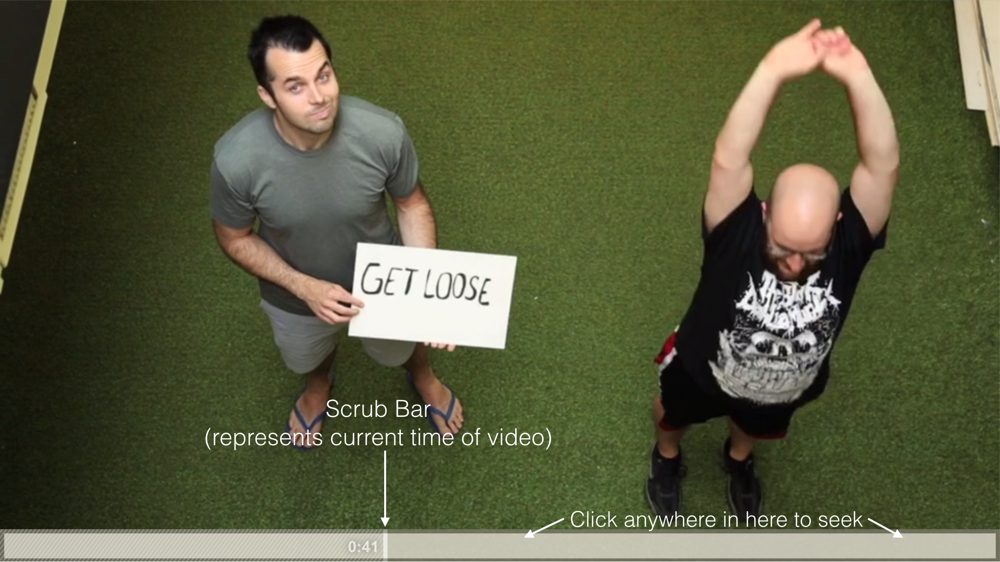

Wistia Frontend Developer Challenge

# Overview

Create a basic HTML5 video player that can track how much of a video has been watched.

# System Description

Produce a single page that plays an MP4 video using a basic HTML5 player and some custom controls. Your player should track the portions of the video that have been watched and rewatched.

* Implement and test your solution in one browser of your choice.
* Visually, this doesn't need to be polished, just functional.
* This can all be accomplished with good old javascript, HTML, and CSS. jQuery and other libraries/frameworks should be avoided.
* Include a README with your submission telling us the browser and OS you used, an explanation of your solution's performance characteristics, anything you learned or would do differently if doing this again, and any other notes you think are relevant.

# Requirements

## Playbar

* Always show the current time of the video, next to the play head.
* Clicking in the playbar should move the play head there, and seek the video accordingly.
* The play head should be horizontally draggable and update the time of the video as it moves.
* See the screenshot below for the general look of the playbar. Visual accuracy is nice, but we’re more concerned about it working well.

## Play/pause

* Clicking the video while it’s playing pauses the video.
* Clicking the video while it’s paused plays the video.

## Tracking

* Log a message to the console when 25% of the video has been rewatched (watched at least twice).
* If you seek past a section of the video, the skipped section does not count as watched.
* Watching a section of a video again counts as a rewatch. So if someone watches a 60 second video, then seeks to second 5 and watches until second 30, they've rewatched 25 seconds (41.7%).
* Sections rewatched do not need to be contiguous to count. For example, if someone rewatched seconds 5-10 and seconds 15-20, that counts as 10 seconds rewatched.
* Rewatches for the same time interval should not compound. For example, if I watch seconds 5-10 four different times, that still counts as only 5 seconds rewatched.
* The solution should be accurate to at least 1 second of granularity.
* When performing calculations, you can assume the video can be anywhere from 1 second to 4 hours long, although the sample file below is 1 minute 46 seconds.
* Whatever solution you choose, please note its performance characteristics in your README.

## Bonus considerations (optional, but valued)

* Tracking: Do you have an idea of the time/space complexity of your approach?
* Modularity: how difficult is it to put more than one video on the same page?
* Reusability: how difficult is it to track a different rewatched percentage?
* Consistency: How would the player/tracker behave with videos of different lengths?

# References

You can use this file for your video:
https://embed-ssl.wistia.com/deliveries/9d1b76aa6e0d90c8bae735bf7d2737d0135053b5/file.mp4

Please let us know if you need anything clarified or if you have any questions!