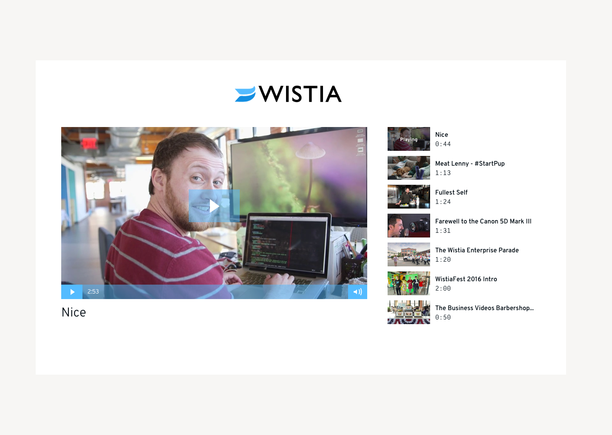
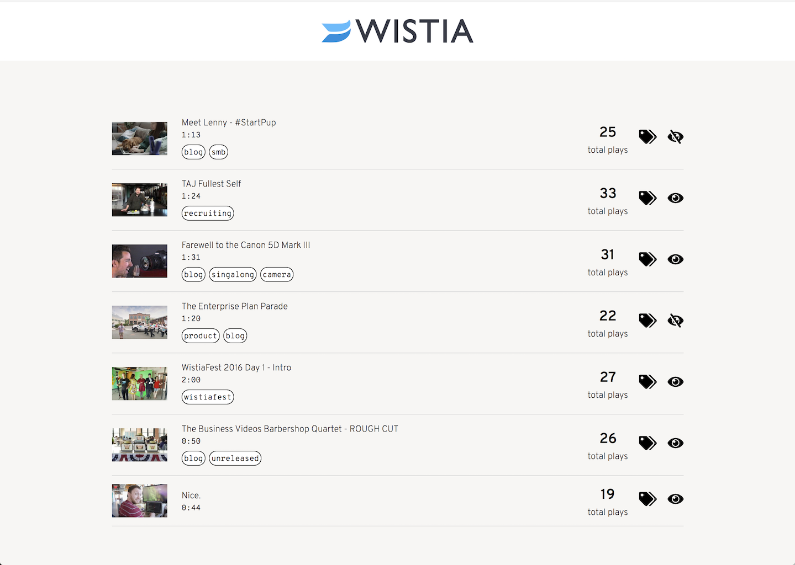
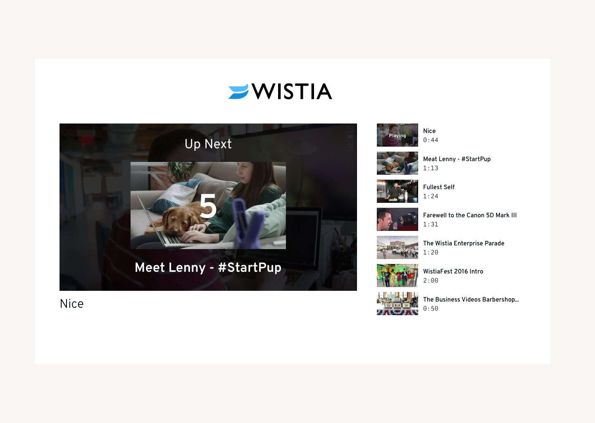
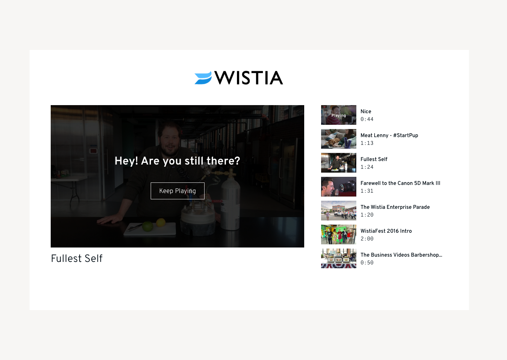

Wistia Full Stack Developer Challenge

# Overview
Enhance an existing lightweight video application with the Wistia API.

# Background
Wistia is a video hosting solution for marketers. We make it easy to upload, manage, share, and track your web video performance. The [Wistia Developer API](https://wistia.com/support/developers) gives you all kinds of programmatic access to your Wistia account and its videos.

# System Description
The video application is made of two views: a landing page to watch videos and an owner dashboard to manage them. To get you coding right away, you'll be provided with a starter kit that includes the frontend and a READ-ONLY API token. The API token is connected to a Wistia account already populated with enough videos to complete the challenge. Think of it as an evolving [MVP](https://medium.freecodecamp.org/what-the-hell-does-minimum-viable-product-actually-mean-anyway-7d8f6a110f38), which you are enhancing.

* Implement and test your solution in one browser of your choice

* The frontend can all be accomplished with good old javascript, HTML, and CSS.

* The backend can be accomplished in Ruby, Ruby on Rails, Python, Elixir, or Node.
  * If you'd like to work with a language that's not listed, give us a shout and we'll work with you to find a language that you know and we can evaluate.

* Include a README with your submission telling us...
  * the browser and OS you used
  * an explanation of your solution's performance characteristics
  * anything you learned or would do differently if doing this again
  * any other notes you think are relevant

* As your app evolves, feel free to change the app routes, folder structure and starter code as you see fit.
  * For example, if you choose Elixir for your backend, you may choose to pull the starter code into your Phoenix app's templates and static folder.

# Installation
## Step 1: Serve `./client` from a local web server

Any method works. We suggest http-server because it's simple.
```sh
npm install http-server -g
cd /client
http-server
```

## Step 2a. Open localhost:8080/playlist.html


## Step 2b. Open localhost:8080/dashboard.html


# Requirements
## Implement autoplay for playlist
Evolve the landing page to autoplay videos as designed:
* A 5-second countdown appears between videos
* Viewer is prompted to "continue watching" after 3 autoplayed videos
* Autoplay is disabled after all videos have played once
* Videos for autoplay are grabbed from queue's top, played videos are added to the bottom
* There's a single playlist with at most 7 videos in the queue
* Autoplay gotchas
  * Depending on which browser you use to test, you may need to configure silent autoplay
  * Embed links have a special flag `playlistLinks=auto`, but this won't produce the behavior outlined in these specs. You'll need to leverage the Javascript Player API methods, [addToPlaylist](https://wistia.com/support/developers/player-api#addtoplaylist-hashedid-options-position) and [replaceWith](https://wistia.com/support/developers/player-api#replacewith-hashedid-options).




## Implement hide and show videos for the owner dashboard
* Create an endpoint to manage the video's visibility
* Wire the endpoint to the eye toggle (strikethrough icon represents hidden)
* Update the playlist landing page to only render videos marked as visible

## Design the database for "search by tag" for the owner dashboard
No code implementation is necessary for this part of the assignment. A written explanation is sufficient.

Imagine a tech lead asks you to design the database for a "search by tag" feature. Users should be allowed to tag videos and find videos matching that tag.

* Create the schema(s) to support tags
* Write a query to print the total number of videos with at least 1 play count
* Write a query to find the video with the most number of tags. If more than one video have the same number of tags, print the one created most recently.


# Additional References
* [Getting started with Wistia's Data API](https://wistia.com/support/developers/data-api)
* [View video stats](https://wistia.com/support/developers/stats-api)

Please let us know if you need anything clarified or if you have any questions!

---
Icons powered by [Font Awesome](https://fontawesome.com/)
